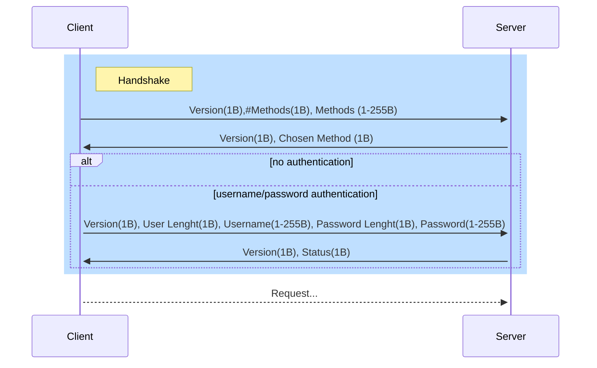

# socks5d

```mermaid
sequenceDiagram
		participant Client
    participant Server
    
    rect rgb(191, 223, 255)
    note right of Client: Handshake
    Client ->>+ Server: Version(1B),#35;Methods(1B), Methods (1-255B)
    Server ->>+ Client: Version(1B), Chosen Method (1B)
      alt no authentication
      else username/password authentication
      Client ->> Server: Version(1B), User Lenght(1B), Username(1-255B), Password Lenght(1B), Password(1-255B)
      Server ->> Client: Version(1B), Status(1B)
      end
    end
    Client -->> Server: Request...
    

```

